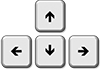

--- 
title: "Вступ до R"
author: "Юрій Клебан"
date: "2021-04-15"
site: bookdown::bookdown_site
documentclass: book
bibliography: [book.bib, packages.bib]
biblio-style: apalike
link-citations: yes
description: "Курс вступ до програмування в R, Проект DataClass"
favicon: "favicon.ico"
cover-image: "images/cover.png"
github-repo: "kleban/r-intro"
---

# Загальна інформація {-}

<div class="alert alert-danger">
<i class="far fa-bell fa-alert fa-2x"></i>
Увага. Курс у процесі розробки. Матеріали додаватимуться по мірі їх написання та рецензування.
</div>

<div class="text-center">
{#id .class width=75%}
</div>

Курс створено у межах проекту <strong>"Підготовка, обробка та ефективне використання даних для наукових досліджень (на основі R)"</strong>, що підтримує Європейський союз за програмою [House of Europe](https://houseofeurope.org.ua/).

<!--chapter:end:index.Rmd-->

# Вступ до курсу {#chapter1}

## План {-}

- [Що таке R?](#chapter11)
- [Історія створення R](#chapter12)
- [Основи роботи з R](#chapter13)
    - [R Project](#chapter131)
        - [Завантаження та інсталяція R](#chapter1311)
        - [Перший запуск R GUI](#chapter1312)
        - [Поняття робочого простору](#chapter1313)
        - [Поняття робочого каталогу](#chapter1314)
        - [Допомога (help/?)](#chapter1315)
    - [Робота з R Studio](#chapter132)
        - [Завантаження та інсталяція RStudio Desktop](#chapter1321)
        - [Створення першого проекту в RStudio](#chapter1322)
    - [Робота з Jupyter Notebook](#chapter133)
    - [Огляд додаткових IDE та сервісів для роботи з R](#chapter134)
- [Основи роботи з пакетами в R](#chapter14)
  - [Команди для роботи з пакетами](#chapter141)
  - [Робота з пакетами в RStudio](#chapter142)
    
---

## Що таке R? {#chapter11}

R є поширеною мовою програмування для роботи з даними (`DataScience`) та машинного навчання (`Machine Learning`). Але Ви можете скористатися засобами R і для простіших задач: обчислення, візуалізація даних.

Синтаксис мови програмування R є досить простим для вивчення та використання, а широкий набір готових пакетів дозволяє використати готові розробки для виіршення широкого спектру задач від статистичних обчислень до навчання нейронних мереж для розпізнавання/класифікації зображень.

Важливо відмітити, що мова програмування R є безкоштовною (`free`) і має відкритий код (`open source`).

R має ряд корисних властивостей, серед яких варто виділити:

* **Візуалізація даних**. Побудова різноманітих видів графіків, робота з мапами, широкий спектр бібліотек та налаштувань до них.

* **Повторне використання коду**. На відміну від електронних таблиць, що мають обмеження на кількість спостережень (наприклад, MS Excel), R дозволяє працювати з великими масивами даних та перезапускати обчислення у потрібний момент не створюючи додаткових копій даних. 

* **Машинне навчання**. R дозволяє використати для побудови, навчання та тестування моделей, а також оптимізації гіперпараметрів та відбору факторів дуже велику кількість алгоритмів. Існують також спеціальні пакети, що об'єднують у собі усі описані функції та алгоритми, наприклад, `caret` та `mlr`.

* **Автоматизація**. Написаний код та проекти можна перетворити у готові до публікації та впровадження продукти (deployment) або використовувати напрацьовані алгоритми для швидкого вирішення схожих задач (pipeline).

Також можна виділити досить корисні фічі **Розробка веб-застосунків** та **Звітність**, адже, використовуючи спеціальні бібліотеки (`shiny`, `shinydashboard`, `flexdashboard`, `rmarkdown`, `knitr` тощо), результати виконаної роботи можна "оживити" або сформувати "на льоту" готові до презентації документи.

---

## Історія створення R {#chapter12}

Мова програмування `R` виникла як продовження статистичної мови `S`. Назва мови `S` була обрана аналогічно до `C`. Створена `S` була у 1976 році компанією `Bell Labs`. Мова `S` мала кілька версій і широко використовувалася для комерційного програмування. Найпотужнішою була версія `S-Plus`, що мала реалізацію за досить немалу кількість функцій під `Windows` та `Unix`-платформи, що стримувало її розвиток. Саме в цей момент розпочинається історія `R`.

Влітку 1993 року двоє молодих новозеландських вчених анонсували свлю нову розробку, яку вони назвали `R` (є інформація, що  буква "R" була обрана тому, що вона стоїть перед "S" у латинському алфавіті, тут є аналогія з мовою "C", якій передувала мова "B") [@R-stats-book]. За задумом авторів (Robert Gentelman та Ross Ihaka) це повинна була бути нова реалізація мови `S`, що відрізнялася від `S-Plus` деякими деталями, наприклад, роботою з локальними та глобальними змінними, пам'яттю тощо. Фактично було створено нову мову, що відгалуджується від `S`.

Проект з самого початку розвивався досить повільно, але коли у команди розробників `R` з'явлися ресурси, в тому числі зручна системи створення розширень (пакетів), все більше аналітиків, статистиків, вчених, програмістів почало переходити з `S-Plus` на `R`. Коли були усунуті проблеми роботи з пам'яттю перших версій `R`, на цю мову почали переходити користувачі інших статистичних пакетів (SAS, Stata, SYSSTAT).

Кількість книг та публікацій у мережі Інтернет по роботі з R постійно зростає разом із зацікавленням молодих і вже досвідчених спеціалістів зі сфери ІТ темою науки про дані, машинним навчанням, аналітикою для бізнесу, охорони здоров'я тощо.

---

## Основи роботи з R {#chapter13}

### R Project {#chapter131}

`R` є безкоштовним програмним забезпеченням, що розповсюджується за умовами [GNU General Public License](https://www.r-project.org/COPYING). Код, написаний на `R` компілюється та запускається на різних платформах: UNIX, Windows, MacOS [@R-base].

#### Завантаження та інсталяція R {#chapter1311}

Для завантаження актуальної версії R варто перейти на сайт проекту [https://cran.r-project.org/](https://cran.r-project.org/).

На сайті обираємо завантаження `R` для потрібної операційної системи. У межах курсу ми вокристовуємо `ОС Windows`, проте на синтаксис мови програмування та процес написання коду це не впливає: 

\begin{figure}
\includegraphics[width=10.15in]{images/chapter1/r_gui_1} \caption{Завантаження R. Вибір ОС}(\#fig:unnamed-chunk-1)
\end{figure}

У наступному вікні клікаємо на **install R for the first time**:


\begin{figure}
\includegraphics[width=10.32in]{images/chapter1/r_gui_2} \caption{Завантаження R. Перша інсталяція}(\#fig:unnamed-chunk-2)
\end{figure}

Далі обираємо **Download R 4.X.X for Windows**, де `4.X.X` версія `R`, яка може бути відмінною на момент вивчення курсу: 

\begin{figure}
\includegraphics[width=10.92in]{images/chapter1/r_gui_3} \caption{Завантаження R. Завантаження версії для ОС}(\#fig:unnamed-chunk-3)
\end{figure}

Після завантаження файлу інсталяції потрібно його запустити. Зазвичай завантажений файл можна побачити у лівому нижному кутку браузера або у розділі "Завантаження" Вашого браузера. Наприклад, у браузері `Google Chrome` знайти цей пункт меню так:

\begin{figure}
\includegraphics[width=4.56in]{images/chapter1/chrome_download_button} \caption{Завантаження R. Розділ "Завантаження" у Google Chrome}(\#fig:unnamed-chunk-4)
\end{figure}

Процес інсталяції ПЗ не відрізняється від інших програм і детального опису не потребує. Основним тут є запам'ятати шлях встановлення проекту або "відмітити галочками" пункти щодо публікації на *Робочий стіл* чи у меню швидкого доступу ярликів  для того, щоб знайти файли запуску. 

#### Перший запуск R GUI {#chapter1312}

За замовчуванням під час інсталяції пропонується шлях `C:\Program Files\R\R-4.X.X`. 

Для запуску `R GUI` (стандартного графічного інтерфейсу для роботи з `R`) потрібно зайти у папку `bin\x64` (або `i386`, якщо у Вас 32-х розрядна ОС) та запустити файл `Rgui.exe`.

Вигляд вікна `R GUI` зображено нижче:

\begin{figure}
\includegraphics[width=9.61in]{images/chapter1/r_gui_4} \caption{Вигляд головного вікна RGui}(\#fig:unnamed-chunk-5)
\end{figure}

<div class="alert alert-info">
<i class="fas fa-info-circle fa-alert fa-2x"></i>
*GUI* (*G*raphical *U*ser *I*nterface) - набір візуальних компонентів для інтерактивної взаємодії користувача з програмним забезпеченням.
</div>

У вікні `R Console` можна вводити команди/інструкції `R`, що будуть виконуватися:

Результати виконання команд зберігаються у памяті програми і можуть бути використані у наступних блоках коду:

\begin{figure}
\includegraphics[width=8.71in]{images/chapter1/r_gui_5} \caption{Вигляд консолі для команд RGui}(\#fig:unnamed-chunk-6)
\end{figure}
Середовище `R GUI` має широкий спектр функцій і дозволяє написати будь-якого рівня складності проекти на R, проте він є лише базовою графічною обгорткою для `R`. Розглянемо інші зручніші середовища для написання `R`-коду.

#### Поняття робочого простору {#chapter1313}

У процесі виконання коду створені об'єкти/змінні та функції зберігаються у поточній сесії. У `R` є можливість переглянути список збережних елментів, видалити усі або окремі, зберегти стан поточної сесії диск та завантажити його пізніше, щоб не проходти усі етапи виконання коду повторно _(інколи дуже складний код може виконувати досить довго і збереження проміжних результатів може бути хорошим рішенням)_.

Для прикладу створимо дві змінні `var1`, `var2` та виведемо на консоль їх значення: 


```r
var1 <- 10
var2 <- sqrt(15)
var1
```

```
## [1] 10
```

```r
var2
```

```
## [1] 3.872983
```

Для того аби переглянути список змінних у поточній сесії варто скористатися **`ls()`**:


```r
ls()
```

```
## [1] "var1" "var2"
```

Якщо виникає потреба очистити робочий простір і звільними пам'ять використовується команда `rm()`. Так, щоб очистити усі змінні можна скористатися `rm(list = ls())`, якщо ж Ви хочете видалити якусь одну/дві змінних, то просто вкажіть імена:


```r
rm(list = c("var1"))
ls()
```

```
## [1] "var2"
```

Таким чином, після виконання коду вище, залишиться лише змінна `var2`.

Зберігання образу (`image`) робочого простору на диск здыйснюэться за допомогою команди `save.image("шлях до файлу.RData")`, а його зчитування за допомогою `load("шлях до файлу.RData")`:


```r
# Clear workspace
rm(list = ls())

# declare data
a <- 10
b <- a + 15

# Save image to file
save.image("tmp.RData")
```


```r
# Clear workspace
rm(list = ls())

# load image to file
load("tmp.RData")

print(a)
```

```
## [1] 10
```

```r
print(b)
```

```
## [1] 25
```
У прикладі 2 не створюєть жодного параметра, проте вони збережні у файлі сесії.

Для того аби зберегти та зчитати окремий об'єкт, а не всі елементи сесії у `R` э спеціальний формат `.RDS`, який реалізовується методами `saveRDS(об'єкт, file="шлях_файлу.rds")` та `readRDS(file="шлях_файлу.rds")`.

#### Поняття робочого каталогу {#chapter1314}

Робота в будь-якому середовищі передбачає зв'язок із поточним каталогом, відносно якого будуються шляхи до файлів. Звичайно можна писати завжди повний шлях до файла, проте такий підхід є досить негнучким і під час перенесення коду між ПК створює чимало проблем розробникам.

Для визначення базового каталогу `R` в поточній сесії використовують команду `getwd()`. Якщо Ви користуєтеся `RStudio` та створили проект, то цей каталог буде відповідати повному шляху до папки  проекту:


```r
getwd()
```

```
## [1] "E:/Repos/YuRa/r-intro"
```

Для того аби змінити поточний робочий каталог використовують команду `setwd(шлях)`. Після запуску цієї команди функцій `getwd()` буде вказутивати уже на нову адресу/шлях.

<div class="alert aler-warning">
<i class="fas fa-2x fa-life-ring fa-alert"></i>
Варто знати та вміти будувати **абсолютні** та **відносні** шляхи до каталогів та файлів, ці знання корисні для роботи з усіма мовами програмування та більшістю ПЗ для роботи з даними.
</div>

Для запису шляху у ОС Windows можна скористатися 2-ма способами:

* `/` - **_слеш_**, записується як один знак;
* `\\` - **_бекслеш_**, записується як два знаки.

У прикладі нижче обидва шляхи ведуть до тієї ж папки (`drive` - буква диска):

```r
setwd("drive:/folder1/folder2/")
setwd("drive:\\folder1\\folder2\\")
```

Для перегляду інформації про наявні каталоги та файли у поточній робочій папці можна скористатися командою `dir()` або `list.files()`:


```r
dir()
```

```
##  [1] "_bookdown.yml"          "_bookdown_files"        "_output.yml"           
##  [4] "01-chapter1.Rmd"        "01-chapter1_files"      "01-intro_files"        
##  [7] "02-chapter2.Rmd"        "02-chapter2_files"      "03-chapter3.Rmd"       
## [10] "06-chapter6.Rmd"        "07-references.Rmd"      "book.bib"              
## [13] "css"                    "favicon.ico"            "images"                
## [16] "inc"                    "index.md"               "index.Rmd"             
## [19] "index.utf8.md"          "packages.bib"           "preamble.tex"          
## [22] "r-intro.log"            "r-intro.rds"            "README.md"             
## [25] "render_commands"        "render1ed07072671f.rds" "RIntro.Rproj"          
## [28] "tmp.RData"
```

```r
list.files()
```

```
##  [1] "_bookdown.yml"          "_bookdown_files"        "_output.yml"           
##  [4] "01-chapter1.Rmd"        "01-chapter1_files"      "01-intro_files"        
##  [7] "02-chapter2.Rmd"        "02-chapter2_files"      "03-chapter3.Rmd"       
## [10] "06-chapter6.Rmd"        "07-references.Rmd"      "book.bib"              
## [13] "css"                    "favicon.ico"            "images"                
## [16] "inc"                    "index.md"               "index.Rmd"             
## [19] "index.utf8.md"          "packages.bib"           "preamble.tex"          
## [22] "r-intro.log"            "r-intro.rds"            "README.md"             
## [25] "render_commands"        "render1ed07072671f.rds" "RIntro.Rproj"          
## [28] "tmp.RData"
```

#### Допомога (help/?) {#chapter1315}

Для отримання швидкої довідки в `R` варто скористатися функціє `help(назва_об'єкта_або_функції)` або `?назва_об'єкта_або_функції`:

```r
# Get help for intersect() function
help(intersect)
```
Якщо є потреба отримати інформацію про пакет скористайтеся:

```r
help(package = "stats")
```

### Робота з R Studio {#chapter132}

#### Завантаження та інсталяція RStudio Desktop {#chapter1321}

**RStudio** - це інтегроване середовище розробки для `R`. Воно включає у себе консоль, підсвічування синтаксису (підказки), прямий запуск коду, інструменти для візуалізації графіків, html-коду, історію виконаних команд, відлагоджування коду, управління робочими просторами, підтримка різних видів розмітки та багато іншого. RStudio має версію з відкритим кодом та комерційну версію для `Windows`, `Linux` та `Mac`, а також веб-версію для серверів на Linux `RStudio Server` та `RStudio Server Pro` [@R-studio-site].

<div class="alert alert-info">
<i class="fas fa-2x fa-info-circle fa-alert"></i>
IDE (`integrated development environment`) - комплексне програмне рішення для розробки програмного забезпечення. Зазвичай, складається з редактора початкового коду, інструментів для автоматизації складання та відлагодження програм. Більшість сучасних середовищ розробки мають можливість автодоповнення коду. <a href="https://uk.wikipedia.org/wiki/%D0%86%D0%BD%D1%82%D0%B5%D0%B3%D1%80%D0%BE%D0%B2%D0%B0%D0%BD%D0%B5_%D1%81%D0%B5%D1%80%D0%B5%D0%B4%D0%BE%D0%B2%D0%B8%D1%89%D0%B5_%D1%80%D0%BE%D0%B7%D1%80%D0%BE%D0%B1%D0%BA%D0%B8" target="_blank" >Wikipedia</a>
</div>

Завантажити продукти можна з сайту https://rstudio.com. Щоб знайти середовище, яке ми будемо використовувати під час вивчення курсу варто виконати наступні кроки:

1. У головному меню сайту обрати `Products > RStudio`.
2. Знаходимо на сторінці кнопку для завантаження програми `RStudio Desktop` версії `Open Source` та натискаємо **DOWNLOAD RSTUDIO DESKTOP**:

\begin{figure}
\includegraphics[width=11.4in]{images/chapter1/rstudio_1} \caption{Вибір версії RStudio Desktop}(\#fig:unnamed-chunk-13)
\end{figure}

3. Далі обираємо завантаження безкоштовної версії `RStudio Desktop` з наданого переліку:

\begin{figure}
\includegraphics[width=13.38in]{images/chapter1/rstudio_2} \caption{Завантаження RStudio Desktop}(\#fig:unnamed-chunk-14)
\end{figure}

Після завантаження запускаємо інсталятор `RStudio`. Особливих кроків у цьому процесі немає.

Після запуску IDE RStudio зазвичай складається з 3-х або 4-х блоків:
* Файл, з яким працювали останнім (зліва зверху).
* Консоль для введення коду та виведення результатів (зліва знизу).
* Змінні середовища (`Environment`) (справа зверху) + Історія команд (`History`), Зєднання з зовнішніми ресурсами даних, наприклад, бази даних (`Connections`), навчальна інструкція (`Tutorial`).
* Файли каталогу або проекту (`Files`), Інстальовані пакети (`Packages`), Допомога (`Help`), Візуалізація результатів (`Plots`, `Viewer`).

\begin{figure}
\includegraphics[width=13.86in]{images/chapter1/rstudio_3} \caption{Головне вікно RStudio Desktop}(\#fig:unnamed-chunk-15)
\end{figure}

Для першої демонстрації роботи виконаємо у консолі 2 рядки коду:
\begin{figure}
\includegraphics[width=9.4in]{images/chapter1/rstudio_4} \caption{Приклад написання коду в RStudio Desktop}(\#fig:unnamed-chunk-16)
\end{figure}

Перший рядок з кодом `data <- c(3,7,1,6,3,4,5,4,2)` створює у пам'яті колекцію чисел. Зверніть увагу, що у блоці **Environments** відобраюаться усі змінні, що уснують у поточному робочому просторі (про це буде далі).

Другий рядок `plot(data, type="l")` дозволяє побудувати простий лінійний графік (`type="l" - linear, "p" - point`, `help(plot)` для деталей). Графіки, що "промальовуються" як картинки выдображаються у блоці **Plots**. Якщо ж графік має більш складну візуалізацію з інтерактивними елементами, що використовують уже засоби html/css/js, то він буде відображений у блоці **View**.

Якщо перемкнутися на вкладку **History**, то ми побачимо перелік раніше виконаних команд.

<div class="alert alert-info text-center">Для швидкого "гортання" уже виконаних раніше команд на консолі (_Console_) можна скористатися клавішами Up/Down на клавіатурі: <br>

</div>

#### Створення першого проекту в RStudio {chapter1322}

На відміну від `R Gui` в `RStudio` реалізовано концепцію проектів, що дозволяє організувати код та поєднати різні його частини у межах певного рішення.

Створимо наш перший проект.

Для початку оберемо з верхнього меню пункт `File > New Project`. У вікні вибору способу створення проекту клікаємо `New Directory`. Такий спосіб передбачає, що жодного файлу проекту поки не існує або ми пізніше туди скопіюємо уже готовий код.

\begin{figure}
\includegraphics[width=7.53in]{images/chapter1/rstudio_6} \caption{RStudio Desktop. Новий проект}(\#fig:unnamed-chunk-17)
\end{figure}

На наступному кроці обираємо `New Project`: 

\begin{figure}
\includegraphics[width=7.5in]{images/chapter1/rstudio_7} \caption{RStudio Desktop. Новий проект. Тип проекту}(\#fig:unnamed-chunk-18)
\end{figure}

Після кліку на `Create Project` буде створено папку за попередньо обраним шляхом. Для запуску проекту або швидкого перемикання між проектами можна скористатися як пунктами головного меню, так і підменю проектів справа. Також відкрити проект можна запуском файлу `*.Rproj` у провіднику `Windows`.

\begin{figure}
\includegraphics[width=7.53in]{images/chapter1/rstudio_8} \caption{RStudio Desktop. Новий проект}(\#fig:unnamed-chunk-19)
\end{figure}

Щоб додати новий файл з кодом `R` потрібно обрати з головного меню `File > New file > R Script` або скористатися командою `Ctrl+Shift+N`. Новий файл буде створено з назвою `Untitled[X]`, тому рекомендую одразу його зберегти, наприклад, як `TestCode.R`

Для першого проекту розвяжемо наступну задачу:

> Написати програму, що генерує вектор з 20-ти випадкових чисел у межах [1;5], обчислює середнє та суму чисел, а також виводить гістограму частоти кожного значення (скільки разів дане число повторюється у векторі).

Код для генерації 20-ти випадкових чесел у діапазоні [1;5] матиме наступний вигляд:


```r
vtr <- sample(1:5, 20, replace=TRUE)
vtr
```

```
##  [1] 1 1 1 4 4 4 1 4 1 5 3 2 2 1 3 1 2 4 2 3
```

<div class="alert alert-danger">
<i class="fas fa-bell fa-2x fa-alert"></i>
Результати виконання на Вашому ПК будуть іншими, адже **псевдо**генератор випадкових чисел буде брати іншу "точку відліку" для генерування чисел. Рекомендую перегляду функцію `set.seed(точка відліку - число)`.

_P.S. Також зустрічав у мережі інформацію, що робота `set.seed()` для `R` у `4+` версії може відрізнятися від `3+`. Після перевірки інформації оновлю даний текст._
</div>

Обчислення та виведення на консоль інформації про суму та середнє значення:


```r
vtr_sum <- sum(vtr)
vtr_mean <- mean(vtr)

print(paste0("Sum: ", vtr_sum))
```

```
## [1] "Sum: 49"
```

```r
print(paste0("Mean: ", vtr_mean))
```

```
## [1] "Mean: 2.45"
```

Виведемо гістограму:


```r
hist(vtr, breaks = 5)
```

 

_Примітка. Детальніше про параметри функції `hist()` можна почитати тут:  [https://www.rdocumentation.org/packages/graphics/versions/3.6.2/topics/hist](https://www.rdocumentation.org/packages/graphics/versions/3.6.2/topics/hist)_.

Орієнтовний вигляд вікна `RStudio` після викоання усіх описаних вище операцій матиме настпуний вигляд:

\begin{figure}
\includegraphics[width=10.69in]{images/chapter1/rstudio_10} \caption{RStudio Desktop. Перегляд змінних}(\#fig:unnamed-chunk-23)
\end{figure}

Варто звернути увагу на виділений блок `Environment`, де можна переглянути усі доступні змінні, що є на даний момент у `пам'яті`. До цих параметрів можна звертатися у коді чи з консолі у будь, який момент. _Детальну інформацію про робоче середовище розглянуто нижче._

### Робота з Jupyter Notebook {#chapter133}

Ноутбуки стали зручним та поширеним інструментом для аналізу даних, а також послідовного викладення матеріалів чи результатів дослідження. Перевагою такого інструменту є перемішування коду, результатів його виконання та іншого текстового наповнення, що дозволяє сформувати "на льоту" готові до читання документи.

_*Примітка. Лекційні матеріали даного курсу виконані саме у ноутбуках._

Використання ноутбуків у навчальному процесі дозволяє описати не лише теоретичний матеріал, але приклади коду, що будуть виконувати безпосередньо під час ознайомлення з лекцією. Також слухач курсу може відредагувати наявний код та перевірити результати його виконання.

Розгялнемо процес інсталяції та запуску `Anaconda` (середовище з відкритим кодом для вирішення задач `Data Science`) та `Jupyter Notebook` на ПК.

Для встановлення середовища `Anaconda` потрібно перейти на сайт проекту та завантажити індивідуальну версію продукту: https://www.anaconda.com/products/individual [@Anaconda-site].

_*Примітка. Усі операції у даному курсі виконуються під операційну систему `Windows 10 Education`_.

Процес інсталяції середовища Anaconda не відрізняється від стандарного покрокового вставнолення програм у `Windows`.

Після запуску `Anaconda Navigator` для початку потрібно створити нове середовище та налаштувати роботу `R`: 


Для початку потрібно перейти на вкладку `Environments` та натиснути `Create`:

\begin{figure}
\includegraphics[width=14.12in]{images/chapter1/anaconda_2} \caption{Anaconda. Головне вікно}(\#fig:unnamed-chunk-24)
\end{figure}

У вікні, що відкрилося потрібно відмітити [x] вставновлення інструментів для роботи з `R`:

\begin{figure}
\includegraphics[width=6.49in]{images/chapter1/anaconda_3} \caption{Anaconda. Створення нового середовища на основі R}(\#fig:unnamed-chunk-25)
\end{figure}

Після встановлення R-інструментів оптрібно переключитися на вкладку `Home` та робочий простір:

\begin{figure}
\includegraphics[width=14.67in]{images/chapter1/anaconda_4} \caption{Anaconda. Зміна середовища}(\#fig:unnamed-chunk-26)
\end{figure}

Після завантаження робочого простору оберіть `Launch` для запуску `Jupyter Notebook` з переліку встановлених засобів. `Jupyter Notebook` буде запущено у браузері за замовчеванням Вашого ПК. Відкрити ноутбук можна обравши потрібний файл, а створити новий у меню справа `New` > `Notebook` > `R`:

\begin{figure}
\includegraphics[width=9.64in]{images/chapter1/anaconda_6} \caption{Jupyter Notebook. Створення нового ноутбука}(\#fig:unnamed-chunk-27)
\end{figure}

### Огляд додаткових IDE та сервісів для роботи з R {#chapter134}

Окрім середовищ описаних вище існує ряд досить цікавих інструментів, що роблять досить зручною роботу з `R`-кодом. Розглянемо ці інструменти.

**Visual Studio Code** - безкоштовний редактор коду від `Microsoft`, орієнтовний на велику кількість мов програмування та фреймворків [@vs-code]. Серед інших іструментів у VS Code доступні також розширення для роботи з `R`:

\begin{figure}
\includegraphics[width=12.53in]{images/chapter1/vs_code} \caption{Visual Studio Code. Інсталяція RTools}(\#fig:unnamed-chunk-28)
\end{figure}

**Visual Studio Community Edition** - безкоштовне середовище розробки від компаній Microsoft. VS створено з самого початку для розробки під платформу .NET та мови програмування C#, VB.NET, F# тощо, але з часом отримало багато розширень, що дозволяють у тому числі, працювати і з проектами в `R` [@visual-studio].

**Google Collab** - онлайн сервіс для роботи з ноутбуками для `Data Science` від компанії `Google` [@google-collab]:

\begin{figure}
\includegraphics[width=9.99in]{images/chapter1/google_collab} \caption{Google Collab}(\#fig:unnamed-chunk-29)
\end{figure}

_Примітка. Код у прикладі вище написаний на `Python`._

[**kaggle.com**](https://kaggle.com) - сервіс для змагань з `Data Science` та `Machine Learning`. Окрім переліку змагань, наборів даних сервіс має досить зручні ноутбуки.

\begin{figure}
\includegraphics[width=11.92in]{images/chapter1/kaggle} \caption{Kaggle.com}(\#fig:unnamed-chunk-30)
\end{figure}

Загалом сервісів та середовищ для розробки в `R` існує досить багато і їх кількість зростає, але це не впливає на принципи написання коду та роботу з даними.

---

## Основи роботи з пакетами в R {#chapter14}

### Команди для роботи з пакетами {#chapter141}

Своєю популярністю `R` завдячує, у тому числі, і можливості швидко реалізувати досить складні дослідження за допомогою наборів уже готових функції. Такі функції обєднуються у пакети та публікуються вченими, досліджниками та розробниками зі всього світу.

**Пакети в R** - організовані набори методів та класів для виконання вузького набору задач під час програмування на `R`. Вони містять як функції так і опис способів їх використання, а чтакож дані для відтворення прикладів коду.

Пакети можуть бути завантажені з офіційного сайту проекту [cran.r-project.org](https://cran.r-project.org/web/packages/available_packages_by_name.html) / [@R-base] або інших джерел (dev-версії є доступні на `github`). Завантаження пакетів у `R` можна здійснювати як з локального диска, так і з серверів у мережі інтернет.

Для встановлення пакету використовується команда **`install.packages()`**:

```r
install.packages("fun")
```

Для підключення пакету та його використання варто скористатися `library()`:

```r
packageDescription("fun")
help(package = "fun")
```

<br>
<div class="alert alert-success">
<i class="fas fa-book fa-2x fa-alert"></i>
Дуже рекомендую почитати детальніше про пакети у статті на `DataCamp`:
<a href="https://www.datacamp.com/community/tutorials/r-packages-guide" target="_balnk">R Packages: A Beginner's Guide</a>.
</div>

### Робота з пакетами в RStudio {#chapter142}

Робота з пакетами в RStudio організована досить зручно і дозволяє швидко переглянути інформацію про пакет та функції, які він дозволяє використати.

Для інсталяції та оновлення пакетів можна скористатися меню `Tools`:

\begin{figure}
\includegraphics[width=10.57in]{images/chapter1/packages_1} \caption{RStudio Desktop. Меню інсталяції пакетів}(\#fig:unnamed-chunk-31)
\end{figure}

Після вибору `Install Packages...` відкриється вікно, де можна обрати як джерело інсталяції пакету так і сам пакет з переліку, ввівши кілька перших букв його назви: 

\begin{figure}
\includegraphics[width=10.65in]{images/chapter1/packages_2} \caption{RStudio Desktop. Вибір пакету для інсталяції}(\#fig:unnamed-chunk-32)
\end{figure}

`RStudio` дозволяє також переглянути інстальовані пакети/бібліотеки, розроблені іншими користувачами та завантажені у пам'ять ("галочка" навпроти назви пакету):

\begin{figure}
\includegraphics[width=3.97in]{images/chapter1/packages_3} \caption{RStudio Desktop. Перегляд інстальованих пакетів}(\#fig:unnamed-chunk-33)
\end{figure}

Доступ до функцій та інших елементів пакету можна здійснювати використавши запис `назва_пакету::назва_функції()` без підключення бібліотеки за допомогою `library()`:

\begin{figure}
\includegraphics[width=10.62in]{images/chapter1/packages_4} \caption{RStudio Desktop. Приклад використання пакету `fun`}(\#fig:unnamed-chunk-34)
\end{figure}

Користувачі можуть не тільки завантажувати існуючі пакети,але істворювати власні та роботи їх доступними для дослідників зі всього світу.

<!--chapter:end:01-chapter1.Rmd-->

# Базові конструкції мови R {#chapter2}


## План {-}

- [Оголошення та ініціалізація змінних](#chapter21)
    - [Поняття змінних та оператор присвоєння](#chapter211)
    - [Правила іменування змінних](#chapter212)
- [Базові типи даних](#chapter22)
    - [Типізація в R](#chapter221)
    - [Перевірка та привдення типів даних](#chapter222)
- [Оператори](#chapter23)
    - [Арифметичні оператори](#chapter231)
    - [Оператори відношення](#chapter232)
    - [Логічні оператори](#chapter233)
- [Корисні математичні функції](#chapter24)
    - [Заокруглення чисел(round, ceiling, floor, trunc, signif)](#chapter241)
    - [Послідовності чисел (seq, rep)](#chapter242)
    - [Генерація псевдовипадкових чисел](#chapter243)
    - [Інші математичні функції та константи R](#chapter244)
    - [Введення-виведння даних](#chapter245)
---

## Оголошення та ініціалізація змінних {#chapter21}

### Поняття змінних та оператор присвоєння {#chapter211}

Базовим поняттям практично усіх мов програмування є **змінна**. Змінна дозволяє записати значення або об'єкт та назвати його для подальшого доступу, зміни, видалення по імені.

Наприклад, присвоєння змінній `my_variable` значення `10` записується так: `my_variable <- 5` або `my_variable = 5`.

Операція надання змінній певного значення у програмуванні називається **присвоєнням**.

_Важливо! Зверніть увагу, що присвоєння (`<-`, `=`) та рівність (`==`) це різні поняття. Оператор `==` здіснює перевірку співпадіння значення двох змінних/об'єктів та повертає результат у вигляді логічного значення `TRUE` (якщо значення рівні) або `FALSE` (якщо значення не рівні)_.

Знак `<-` не є часто використовуваним у різних мовах програмування, зазвичай для присвоєння користуються `=`. Проте в R освновним способом засобом початкової ініціалізації змінних є `<-`.

_Також у програмуванні на R використовуються оператори присвоєння `<<-`, `->`, `->>`. Про них можна прочитати за лыками нижче._

<div class="alert alert-success">
<i class="fas fa-alrt fa-2x fa-link"></i>
 Рекомендую почитати про різницю між операторами присвоєння у R <code>&lt;-</code> та <code>=</code> тут:

 1. [Why do we use arrow as an assignment operator? (Colin FAY)](https://colinfay.me/r-assignment/).
 2. [Difference between assignment operators in R (Ren Kun)](https://renkun.me/2014/01/28/difference-between-assignment-operators-in-r/).
 3. [Assignment Operators](https://stat.ethz.ch/R-manual/R-devel/library/base/html/assignOps.html).
</div>

Приклад:


```r
x <- 45
y <- 10
z <- x + y # z = 45 + 10
z
```

```
## [1] 55
```

Розберемо приклад, описаний вище:

* У першому рядку оголошується змінна `x` і їй присвоюється значення `45`.
* У другому рядку оголошується змінна `y` і їй присвоюється значення `10`.
* У третьому рядку оголошується змінна `z` і їй присвоюється значення суми `x` + `y`. <br>
<small><i>`#` у R використовується як коментар коду, текст написаний після нього ігнорується.</i></small>
* У четвертому рядку відбувається виведення на консоль змінної `z`.

### Правила іменування змінних {#chapter212}

Є кілька основних правил іменування змінних у R:
1. Ім'я змінної може складатися з **букв** [a-z, A-z], **цифр** [0-9], **крапки** `.` та нижнього **підкреслювання** `_`.
2. Ім'я змінної повинно починатися з **букви або крапки**. Якщо воно починається з крапки, то наступним символом повинна бути буква.
3. Не можна використовувати зарезервовані ключові слова мови програмування для іменування змінних, наприклад, `TRUE`/`FALSE`.

Ім'я змінної не може містити пробіл (`space`). Якщо є потреба назвати об'єкт кількома словами, то їх зазвичай розділяють підкресленням `_` або крапкою `.`. Наприклад, змінну можна назвати `my_variable_name` або `my.variable.name`. Назва `myVariableName` ([camel case](https://en.wikipedia.org/wiki/Camel_case)) теж буде коректно сприйнята мовою програмування R, проте такий запис тут вживається не часто.

<span class="text-success">Приклад коректного іменування змінних:</span> `total`, `zminna`, `Sum`, `.length_of_something`, `Number123, x_1`.

<span class="text-danger">Приклад неправильного іменування змінних:</span> `tot@l`, `5x_1`, `_variable`, `FALSE`, `.0ne`.

## Базові типи даних {#chapter22}

### Типізація в R {#chapter221}

Усі мови програмування мають власну типізацію даних з якими працюють. Тип даних - це набір властивостей певних об'єктів та операцій, що можна з ними виконувати. Так, наприклад, з **цілими числами** можна виконувати арифметичні операції додавання, віднімання та інші. Набори символів (простими словами **текст**) зазвичай можуть використовуватися для пошуку у них елементів, редагування (шляхом видалення частини існуючого або додавання нового тексту), склеювання та розділення на частини.

У `R`, на відміну від строго типізованих мов програмування, тип даних визначається на основі поточного значення елемента і може змінюватися у процесі виконання.

Розгялнемо приклад коду з мови програмування `C#` (мова родом із `C`/`Java`):

```csharp
int a = 10;
a = "some text";
```

Подібний код у `C#` передбачає створення нової змінної `a` типу `int` (`integer` - ціле число), а потім відбувається присвоєння для `a` текстового фрагмента (тип `string` у `С#`). Такий код не буде запущено і виникне <span class="text-danger">**помилка компіляції**</span>.

Розглянемо приклад коду з `R`:


```r
a <- 10
a <- "some text"
a
```

```
## [1] "some text"
```

Такий код виконається і на консоль буде виведено `some text`, адже у 1 першому рядку було присвоєно ціле число, у другому - текст. Таким чином `R` має **динамічну типізацію**, що дозволяє у ту ж саму змінну записати значення різних типів. Проте варто пам'ятати, що попереднє значення буде втрачено.

До базових типів даних у R варто віднести:

* Числа з дробовою частиною (`decimal numbers`), як наприклад, `4.0`, `15.214`, що називаються **`numeric(s)`**.
* Натуральні числа (`natural numbers`), як наприклад, `4`, `15`, що називаються **`integer(s)`**.
* Логічні значення (`boolean values`), тобто `TRUE` та `FALSE` (які також можна скорочено записувати `T` та `F`), що називаються **`logical`**.
* Текст або рядки (`string values`), як наприклад, `"Hello"`, `"12 is number"`, що називаються **`character(s)`**.

Оголосимо для прикладу три змінні: `my_numeric` - число, `my_character` - текст, `my_logical` - логічне значення.

```r
my_numeric <- 5
my_character <- "universe"
my_logical <- FALSE
```

Замінимо значення `my_character <- "5"` та спробуємо знайти суму значень:


```r
my_character <- "5"
my_sum <- my_numeric + my_character
```

У результаті виклання даного коду ми отримаємо помилку, адже значення `5` та `"5"` є елементами різних типів даних, перевіримо типи за допомогю функції `class()`:


```r
class(5)
```

```
## [1] "numeric"
```

```r
class("5")
```

```
## [1] "character"
```

Виконання коду `class(5)` показує нам, що `5`є значенням числового типу даних `numeric`, а `class("5")` відповідає тексту `character`, тому арифметична операція додавання між цими значеннями неможлива.

### Перевірка та привдення типів даних {#chapter222}

У випадку коли тип даних потрібно визначити у процесі виконання програми/коду та перетворити значення використовується приведння типів даних.

*Приведення типів даних* - операція перетворення значення з одного типу даних в інший. Важливо памятати, що не завжди приведення типів даних може бути здійснено. Так, наприклад, значення `"5"` (`character`) можна досить просто привести до `5` (`numeric`), проте `"five"` не буде зрозумілим для інтерпритатора.

Для перевірки належності елемента до певного типу даних використовують спеціальну функцію `is.назва_типу(значення)`. Ця функція повертає `TRUE`, якщо елемент належить даному типу і `FALSE`, якщо не належить.

Розглянемо приклад:


```r
my_numeric <- 5
my_character <- "five"
my_logical <- FALSE

is.numeric(my_numeric)
```

```
## [1] TRUE
```

```r
is.character(my_numeric)
```

```
## [1] FALSE
```

Для перетворення типу даних можна скористатися функцією `as.назва_типу(значення)`. У результаті виконання функції буде повернуто значення потрібного типу або пусте значення `NA`, якщо таке приведення не є можливим:


```r
a <- 5
b <- "10"
c <- "10, 20"
as.numeric(b)
```

```
## [1] 10
```

```r
as.numeric(c)
```

```
## Warning: NAs introduced by coercion
```

```
## [1] NA
```

Результат виконання функцій можна записувати у змінні і використовувати у наступних обчисленнях:


```r
a <- 5
b <- "10"
b <- as.numeric(b)
a + b
```

```
## [1] 15
```


```r
number <- as.integer(54)
typeof(number)
```

```
## [1] "integer"
```

```r
class(number)
```

```
## [1] "integer"
```

Повний перелік типів та методів перевірки і приведення їх типів ображений нижче:

| Назва типу | Метод перевірки типу | Метод приведення типу |
|---------|---------|--------|
|Array|is.array|as.array|
|**Character**|is.character|as.character|
|Complex |is.complex |as.complex|
|Dataframe |is.data.frame |as.data.frame|
|**Double** |is.double |as.double|
|Factor |is.factor |as.factor|
|List |is.list| as.list|
|**Logical** |is.logical |as.logical|
|Matrix |is.matrix |as.matrix|
|**Numeric** |is.numeric |as.numeric
|Raw| is.raw| as.raw|
|Time series (ts)| is.ts| as.ts|
|Vector| is.vector |as.vector|

---

## Оператори {#chapter23}

### Арифметичні оператори {#chapter231}

`R` можна використовувати як звичайни калькулятор. 

Розглянемо набір звичних арифметичних операторів, що відомі з початкової школи:
* Додавання: `+`.
* Віднімання: `-`.
* Ділення: `/`.
* Множення: `*`.

А також більш складні оператори:
* Піднесення до степеня: `^` (вводиться з клавіатури як `Shift+6` на ENG-розкладці клавіатури).
* Остача від ділення (ще може називатися "ділення по модулю"): `%%` (вводиться з клавіатури як `Shift+5`).
* Ділення націло: `%/%`.

Розглянемо приклад **додавання** чисел:


```r
5 + 10
```

```
## [1] 15
```


```r
5 + 4 + 15
```

```
## [1] 24
```

```r
5 + 53 + 343
```

```
## [1] 401
```


```r
(5 + 8) + (4 + 9)
```

```
## [1] 26
```

<div class="alert alert-info">
<i class="fas fa-question fa-alert fa-2x"></i> 
_Примітка_. Використання "круглих" дужок у прогрмуванні виразах має пріоритет аналогічний до загальноприйнятих у математиці.</div>

Розглянемо приклад **віднімання** чисел:


```r
47 - 21
```

```
## [1] 26
```


```r
15 - (10 - 25)
```

```
## [1] 30
```

<div class="alert alert-info">
<i class="fas fa-alert fa-2x fa-question"></i> _Примітка_. Заміна знаків до/в "дужках" тут працює так само як працювала у  школі :)
</div>

Приклади **множення** чисел:


```r
5 * 3
```

```
## [1] 15
```


```r
5 * (2 + 5)
```

```
## [1] 35
```

Приклади **ділення** чисел:


```r
12 / 2
```

```
## [1] 6
```


```r
(4 + 7) / 3
```

```
## [1] 3.666667
```

**Піднесення до степеня** за допомогю оператора `^` є досить простим. Так, наприклад, `3^2` дорівнює 9, а `2^3` -  це `2*2*2` і дорівнює 8.  


```r
5^2
```

```
## [1] 25
```


```r
(1+3)^3 + 100 
```

```
## [1] 164
```

**Остача від ділення** дозволяє знайти залишок одного числа від ділення на інше число. 

Наприклад, остача від ділення націло 5 на 2 дорівнює 1, бо `2 * 2 (=4) + 1 = 5`


```r
28 %% 7
```

```
## [1] 0
```


```r
17%%5
```

```
## [1] 2
```

**Ділння націло** залишає лише цілу частину від ідленнядвох чисел:


```r
28 %/% 7
```

```
## [1] 4
```


```r
17 %/% 5 
```

```
## [1] 3
```

```r
Sys.setlocale("LC_CTYPE", "ukrainian")
```

```
## [1] "Ukrainian_Ukraine.1251"
```

```r
# пробіли між цифрами та операторами можна не лишати, це робиться для зручності візуального сприйняття коду
```

<div class="alert alert-info">
В окремих випадках інтерпритатори `R` можуть некоректно читати або взагалі ввжати за помилку наявність кирилиці у коді. Тоді варто вказати явно локалізацію, яку Ви бажаєте використовувати. Для української локалізації варто на початку коду додати рядок: 
```r
Sys.setlocale("LC_CTYPE", "ukrainian")
```
</div>

### Оператори відношення {#chapter232}

**Оператори відношення** відповідають за порівнняння двох об'єктів між собою та повертають значення логічного типу `TRUE`, якщо результат істинний та `FALSE`, якщо результат хибний.

Перелік операторів відношення:

* Більше або дорівнює `>=`.
* Менше `<`.
* Менше або дорівнює `<=`.
* Дорівнює `==`.
* Не дорівнює `!=` 

Для демонстрації принципів роботи операторів відношення оголосимо 3 змінні `a`, `b` та `c`.


```r
a <- 12
b <- 5
c <- 7
```

Розгялнемо кілька прикладів використання описаних вище операторів.

Оператори, що відповідають за первірку на "більше/менше": 


```r
a > b
```

```
## [1] TRUE
```

```r
b + c < a
```

```
## [1] FALSE
```

```r
b + c <= a
```

```
## [1] TRUE
```

Оператори, що відповідають за перевірку на "рівність/нерівність":


```r
a != b
```

```
## [1] TRUE
```

```r
a == b + c
```

```
## [1] TRUE
```

```r
b == c
```

```
## [1] FALSE
```

### Логічні оператори {#chapter233}

До логічних операторів у `R` відносяться:

* І `&` (амперсант, `Shift-7`) - виконання усіх умов одночасно.
* АБО `|` (вертикальна риска, `Shift+\`) - виконання однієї із умов.
* НЕ `!` (знак оклику, `Shift+1`) - заперечення.

Важливо розуміти відмінності між цими операторами вміти використовувати результи їх роботи. Для початку варто розглянути таблицю істинності:

| A | B | Оператор **І** | Оператор **АБО** | Заперечення A (**не A**)|
|---|---|-------|------|-------|
|FALSE|FALSE|FALSE|FALSE|TRUE|
|FALSE|TRUE|FALSE|TRUE|TRUE|
|TRUE|FALSE|FALSE|TRUE|FALSE|
|TRUE|TRUE|TRUE|TRUE|FALSE|

<div class="alert alert-danger">
<i class="fa-2x fas fa-alert fa-battery-quarter"></i>
Матеріали розділу не доповнені прикладами.
</div>

---

## Корисні математичні функції {#chapter24}

### Заокруглення чисел (round, ceiling, floor, trunc, signif) {#chapter241}

Як ми знаємо з математики, що заокруглення чисел буває "вверх", "вниз" або відносно деякого значення, зазвичай пов'язаного із цифрою `5` (`3.6` заокруглюємо до цілого як `4`, а `3.2` як `3`, ввжаючи `3.5` межею).

<div class="alert alert-danger">
<i class="fas fa-alert fa-2x fa-warning"></i>
Увага! Заокрулення чисел у програмуванні може призводити до помилок у результатах  обчислень. Для задач бізнесу або технічних процесів мінімальні відхилення можуть призводити до викривлених результатів або збоїв у системах.
</div>

<i class="far fa-sticky-note"></i> _**Функція `round()`**_

<div class="alert alert-info"><i class="fas fa-2x fa-alert fa-info-circle"></i> &nbsp; Примітка. Тут і надалі функції будуть позначатися як <code>назва()</code> (назва і "круглі" дужки).</div>

Для заокруглення дійних чисел (з дробовою частиною) за правилом `<0.5 & >=0.5` (не знаю як називається науково) використовується функція `round(x, y)`, де `x` - число, `y` - точність (кількість знаків після коми/крапки). Наприклад:


```r
round(3.557, 2)
```

```
## [1] 3.56
```

```r
round(3.241, 2)
```

```
## [1] 3.24
```

```r
round(-3.557, 2)
```

```
## [1] -3.56
```

```r
round(-3.241, 2)
```

```
## [1] -3.24
```

Також можна використати `round(x)` з одним параметром, тоді заокруглення відбудеться до цілої частини, наприклад:


```r
round(124.345)
```

```
## [1] 124
```

<i class="far fa-sticky-note"></i> _**Функція `floor()`**_

Для заокруглення до найближчого меншого цілого числа слід скористатися функцією `floor()`:


```r
floor(3.557)
```

```
## [1] 3
```

```r
floor(3.241)
```

```
## [1] 3
```

```r
floor(-3.557)
```

```
## [1] -4
```

```r
floor(-3.241)
```

```
## [1] -4
```

<i class="far fa-sticky-note"></i> _**Функція `ceiling()`**_

Для заокруглення до найближчого більшого цілого числа слід скористатися функцією `ceiling()`:


```r
ceiling(3.557)
```

```
## [1] 4
```

```r
ceiling(3.241)
```

```
## [1] 4
```

```r
ceiling(-3.557)
```

```
## [1] -3
```

```r
ceiling(-3.241)
```

```
## [1] -3
```

<i class="far fa-sticky-note"></i> _**Функція `trunc()`**_

Функція `trunc()` у R використовується для отримання найбільшого цілого числа, яке більше або рівне `x`. Простими словами це означає, що для чисел менших 0 `(x < 0)` `trunc()` працює як `celing()`, а для чисел більших нуля `x > 0`, як `floor()`:


```r
x <- 5.34
print(paste("trunc:", trunc(x), "celing:", ceiling(x), "floor:", floor(x), sep = " "))
```

```
## [1] "trunc: 5 celing: 6 floor: 5"
```

```r
x <- x * -1
print(paste("trunc:", trunc(x), "celing:", ceiling(x), "floor:", floor(x), sep = " "))
```

```
## [1] "trunc: -5 celing: -5 floor: -6"
```

<i class="far fa-sticky-note"></i> _**Функція `signif()`**_

Інколи виникає потреба заокруглити не десяткову частину числа, а десятки, сотні, тисячі і так далі. Розглядемо варіант, коли у нас є велике число `11 547 741.3` і нам потрібно коротко його записати як `11.5 млн` Для таких задач можна використати функцію `signif(x,y)`, де `x` - число, яке потрібно заокруглити до певного порядку, `y` - порядок заокруглення (рахувати від початку). Наприклад:


```r
big_number <- 11547741.3
rounded_big_number <- signif(big_number,3)
rounded_big_number
```

```
## [1] 11500000
```

```r
rounded_big_number / 1000000
```

```
## [1] 11.5
```

### Послідовності чисел (seq, rep) {#chapter242}

<div class="alert alert-danger">
<i class="fa-2x fas fa-alert fa-battery-quarter"></i>
Матеріали розділу у процесі підготовки.
</div>

### Генерація псевдовипадкових чисел {#chapter243}

<div class="alert alert-danger">
<i class="fa-2x fas fa-alert fa-battery-quarter"></i>
Матеріали розділу у процесі підготовки.
</div>


```r
runif(10)
```

```
##  [1] 0.82244275 0.55900258 0.08314240 0.39591854 0.85081916 0.70439832
##  [7] 0.59425773 0.66524382 0.45883936 0.09788942
```

```r
sample(100)
```

```
##   [1]  31   6  60  87  19  13   7  64  52  98  70  29  20  47  66  51  61  96
##  [19]  14  34   2  15  58  10  59  76  44  26  69   9  78  55  92  99  97  41
##  [37]  17  77  39  86   5   3  43  21  37  11  85 100   1  67  40  32  91  88
##  [55]  81  63  71  65  95  28  33   8  24  35  18  49  38  72  94  12  62  30
##  [73]  82   4  80  54  48  46  27  45  57  74  73  75  89  22  25  53  90  56
##  [91]  79  68  23  50  83  36  93  84  16  42
```

### Інші математичні функції та константи R {#chapter244}

Окрім описаного вище набору функцій `R` містить дуже велику кількість реалізованих функцій з різних сфер науки, бізнесу, техніки тощо. Прочитати про них можна з офіційної документації пакетів, у яких вони реалізовані та знайти за допомогою функції `help()` або `?name`. 

Далі розглянемо перелік найпоширеніших функцій, що використовуються для розв'язання навчальних задач під час вивчення основ програмування.

| Функція | Призначення, опис |
|---------|---------|
|*log(x)*|Логарифм числа *x* за основою *e*|
|*log(x,n)*|Логарифм числа *x* за основою *n*|
|*exp(x)*|*e* у степені *x*|
|*sqrt(x)*|Корінь квадратний числа *x*|
|*factorial(x)*|Факторіал числа *x*|
|*abs(x)*|Модуль числа *x*|

Також у `R` доступні ряд тригонометричних функцій, які вивчалися у школі і не тільки, серед них `cos(x)`, `sin(x)`, `tan(x)`, а також `acos(x)`, `asin(x)`, `atan(x)`, `acosh(x)`, `asinh(x)`, `atanh(x)`.

Детальніше про кожну з них можна почитати у документації за допомогою кодманди `help(function)`.

## Введення-виведння даних {#chapter245}

<div class="alert alert-danger">
<i class="fa-2x fas fa-alert fa-battery-quarter"></i>
Матеріали розділу у процесі підготовки.
</div>


<!--chapter:end:02-chapter2.Rmd-->

# Основи роботи з даними в R {#chapter3}


## План {-}

- [Набори даних](#chapter31)
- [Вектори (vectors)](#chapter32)
    - [Поняття та спосіб представлення](#chapter321)
    - [Оголошення векторів](#chapter322)
    - [Операції над векторами](#chapter323)
  
---

## Набори даних {#chapter31}

<div class="alert alert-danger">
<i class="fa-2x fas fa-alert fa-battery-quarter"></i>
Матеріали розділу у процесі підготовки.
</div>

## Вектори (vectors) {#chapter32}

### Поняття та спосіб представлення {#chapter321}

Вектори є найпростішим способом представлення колекції даних. З своїм змістом **вектор** - це послідовність однорідних елементів. Якщо ж говорити про мову програмування, то **вектор** - це послідовність елементів одного типу, що розміщені за деяким порядком (індексом).

Вектор прийнято позначати, як x = (x1, x2,..., xn), де х - назва вектора, n - кількість елементів вектора,

### Оголошення векторів {#chapter322}

Вектор - базовий тип даних у `R`, що дозволяє записати колекцію елементів одного типу за допомогою `c()` або без нього, якщо це послідовність значень. 

_Примітка. По суті функція `c()` дозволяє об'єднати кілька векторів._

Розглянемо для прикладу звичайну змінну `x`:

```r
x <- 10
```

По своїй суті `x` у даному випадку є вектором, що складається з одного значення `10`. Ми можемо також записати кілька елементів у змінну `x`:


```r
x <- c(1, 2, 2.5, 3)
x
```

```
## [1] 1.0 2.0 2.5 3.0
```

Елементами вектора можуть бути значення будь якого типу: `numeric`, `character`, `logical` тощо:


```r
v1 <- c(1, 3, 4, 6, 7)
v2 <- c(T, F, F, T, F)
v3 <- c("Hello", "my", "friend", "!")
```

Елементами вектора також послідовності, створені на за допомогою функцій `rep()`, `seq()` та оператора `:`:


```r
vtr <-  2:7
vtr
```

```
## [1] 2 3 4 5 6 7
```

```r
vtr <- 7:2
vtr
```

```
## [1] 7 6 5 4 3 2
```

Якщо є потреба об'єднати кілька векторів, скористайтеся функцією `c()`:


```r
x <- 2:3
y <- c(4,6,9)
z <- c(x, y, 10:12, 100)
z
```

```
## [1]   2   3   4   6   9  10  11  12 100
```

Переглянути коротку описову статистику по вектору можна за допомогою функції **`summary()`**:


```r
summary(z)
```

```
##    Min. 1st Qu.  Median    Mean 3rd Qu.    Max. 
##    2.00    4.00    9.00   17.44   11.00  100.00
```
### Операції над векторами {#chapter323}

<!--chapter:end:03-chapter3.Rmd-->

# Приклади задач та їх розв'язки {#chapter6}

---

- [Задачі](#chapter61)
  - [Послідовності](#chapter611)
- [Рішення задач](#chapter62)
  - [Послідовності](#chapter621)

---

## Задачі {#chapter61}
### Послідовності {#chapter611}

#### Задача {#task1}
Написати програму, що обчислює $y = (x+2)^2 + ln(x)$, де $x$ число з послідовності `100, 105, 110, ..., 200`. Результат вивести у вигляді `data.fame` з колонками $X$ та $Y$.

#### Задача {#task2}
Написати програму, що обчислює $y = \frac{\sqrt{x+2}}{z}$, де $x$ число з послідовності `10, 15, 20, ..., 100`, а $z$ - випадкові значення з діапазону `[-10, 10]`, що відповідає кількості елементів у $x$. Результат вивести у вигляді `data.fame` з колонками $X$, $Z$ та $Y$.

#### Задача {#task3}
Без використання спеціальних функцій написати програму, що сортує вектор за зростанням та спаданням. Елементи вектора є випадковими числами з діапазону `[10,100)`. Кількість елементів у векторі `10`. 

#### Задача {#task4}
Відсортувати вектор таким чином, щоб всі додатні елементи знаходилися на початку, а всі від'ємні – вкінці, і при цьому зберігся початковий порядок елементів в обох групах. Елементи вектора є випадковими числами з діапазону `[-100,100]`. Кількість елементів у векторі `10`.

Наприклад, якщо початковий вектор `x` складається з елементів:

```r
x <- c(1, -5, 10, -8, -2, 5, 4, -9)
```
то після "сортування" він матиме вигляд:

```
## [1]  1 10  5  4 -5 -8 -2 -9
```

#### Задача {#task5}
Написати функцію, що обчислює для поданого вектора суму, середнє, медіану, мінімум та максимум. Результат роботи функції повертається у вигляді списку (`list`). 

#### Задача {#task6}
Задано натуральне число $N$ (вводиться з клавіатури). Знайти суму його цифр. 

#### Задача {#task7}
Знайти найбільший спільний дільник двох натуральних чисел, використавши алгоритм
Евкліда. Алгоритм Евкліда полягає в наступному: від більшого числа віднімається менше до тих пір,
поки вони не стануть рівними; отримане в результаті число і буде найбільшим спільним дільником. 

#### Задача {#task8}
Задано одновимірний масив. Знайти два серед його елементів, модуль різниці яких має
найменше значення. 

#### Задача {#task9}
Знайти мінімальний елемент серед тих елементів масиву $A$, які не є елементами масиву $B$. 

## Рішення задач {#chapter62}

### Послідовності {#chapter621}

---


Рішення до [задачі 3](#task3): 


```r
x <- sample(10:100, size = 10)
  
for(j in 1:(length(x)-1)) {
  
  for(i in 1:(length(x)-1)) {
    
    if(x[i] > x[i+1]) {
      tmp = x[i]
      x[i] = x[i+1]
      x[i+1] = tmp
    }
  }
}

print(x)
```

```
##  [1] 16 25 36 56 57 62 64 76 90 95
```

Рішення до [задачі 4](#task4): 


```r
x <- sample(-100:100, size = 10)
print("Vector before sort:")
```

```
## [1] "Vector before sort:"
```

```r
print(x)
```

```
##  [1] -67 -57 -18 -68 -38 -11 -93 -92 -87   7
```

```r
for(j in 1:(length(x)-1)) {
  
  for(i in 1:(length(x)-1)) {
    
    if(x[i] < 0 & x[i+1] > 0) {
      tmp = x[i]
      x[i] = x[i+1]
      x[i+1] = tmp
    }
  }
}
print("Vector after sort:")
```

```
## [1] "Vector after sort:"
```

```r
print(x)
```

```
##  [1]   7 -67 -57 -18 -68 -38 -11 -93 -92 -87
```

<!--chapter:end:06-chapter6.Rmd-->

```r
Sys.setlocale("LC_CTYPE", "ukrainian")
```

# Джeрела {-}

<!--chapter:end:07-references.Rmd-->

